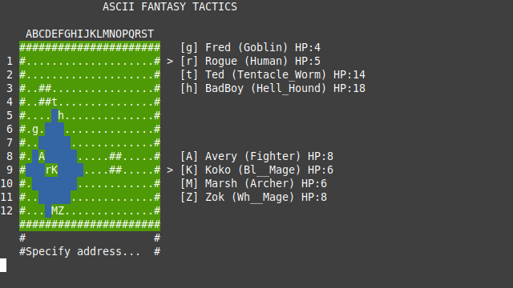
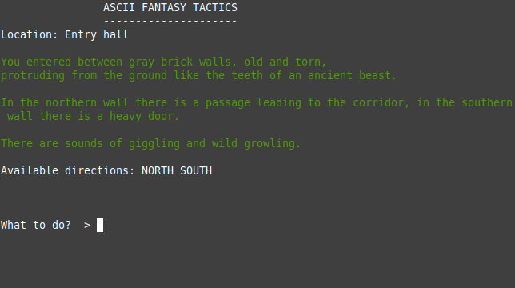

# Ascii Fantasy Tactics

Simple game in text mode, mix of text adventure and Tactics Battle.  

## How to play

Explore dungeon by using `go north`, `go east`, `go south` and `go west` commands, find the way out.  
During exploration you can use `save` command to save state.  
Loading state is available from welcome screen.  
Hint: there is a [map of a dungeon](https://github.com/przem360/ascii-fantasy-tactics/blob/master/design/map.png). You start in room 1 and your goal is room 22.  
Sometimes monsters will attack you, you will need to fight them. In battle mode you can always use `move` and `attack` commands, than choose coordinates in range, ie. `C8`.   
  

Fighters with *Mage* class have spells, you can cast them by using `cast` command than specify ID of a spell, i.e. `fb` for Fire Ball.  
You can also `skip` if you like. Use `info` command to see list of remaining characters and monsters and their position coordinates.  
  
TIPS:  
Type `i` and then `a` on welcome screen to triger invisibility - you can explore the dungeon without fighting with monsters.  
Type `p` on welcome screen, before selecting game mode to set HP values of your team members to 99.  

## Build

The game was tested on Linux but since there is no any *weird* dependencies, should also compile on Mac. Just make sure that `build-essential` package is installed and use `make` to build.  

## Command line options
`-no-log` - turns off logs.  
`-no-color` - turns off colors.  
`-pow-99` - sets HP of all party members to 99. Same as pressing `p` on title screen.  
`-invis` - no random encounters. Same as pressing `i` on title screen.  
Important - if you would like to turn off logs and colors, specify `-no-log` option first.  